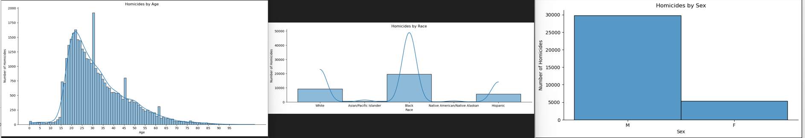

# Final Report (Group 09)

## Introduction 
Our Group Project aims to explore the issue of Gun Deaths in America , which has become a significant concern in the United States in the recent years. We will be focusing on specific aspects of gun violence, including the age of the victim, intent, race, place of incident and education level of the victim involved in the incident. By analyzing these variables, we hope to identify trends and patterns that may reveal insights into the demographics circumstances surrounding gun violence in America. To conduct our analysis, we have used a dataset sourced from the FiveThirtyEight's Gun Deaths in America Project, which contains detailed records of around 100,000 gun-related incidents that occurred in the US between 2012 and 2014. Our ultimate goal is to contribute a better understanding of Gun deaths and gun safety so as to prevent such incidents from occurring in the future. 

## Exploratory Data Analysis
- Below is a Heatmap that shows the correlation between the numeric columns particularly age, police involved, month anf year, and taking a look at them.

.png)

- Below is a violin plot that shows us how education, race and intent are related to gun deaths and if any trends are visible to us.  

.png)

## RESEARCH QUESTION 1:
*How does Educational attainment relate to gun deaths in America and what other factors affect this relationship ?*

The following are a few sub questions that helped me achieve my objectives:
- Is there a correlation between educational attainment and gun deaths rates in the United States after controlling for other demographic and contextual factors, such as age, gender, race, religion and gun ownership rates ? This could be done using regression analysis to examine the contribution of education while keeping the other factors constant.
- To what extent does the knowledge of gun safety or ownership meditate the relationship between gun deaths and education ? This could be monitored by using the "intent" column of the dataset.
- Are there differences in the relationship between education and gun deaths across different age groups, race, or geographical regions? We could explore whether the protective effects of education are stronger for younger or elder individuals for certain racial groups.

If you are interested in looking at the entire analysis , you can click [here](https://github.com/ubco-W2022T2-data301/project-group09/blob/main/analysis/analysis1.ipynb)

Figure 1: Education v/s Intent graph for Gun Deaths in America

- In the above graph we have decreased the number of record taken into account to clearly see how high the rate of suicide and homicide is as compared Accidental or Undetermined deaths.
- We can also notice that people with education of BA+ have really low rates of deaths irrespective of the intent whereas people with Some college , HS or less than HS education have comparatively higher rates of deaths.
- In each intent type, people HS education have highest rates of deaths and then some college , less than HS and then BA+ respectively. But Homicide has a different trend where less than HS education people have second highest rates of deaths compared to the others.

Figure 2: Age v/s Education graph based on different intents of Gun Deaths

The above graph suggests that there is a correlation between education level and age with the likelihood of experiencing premature death by suicide or homicide. Individuals with a higher education level have a lower chance of dying at an early age compared to those with a high school education or lower. People with any education level are more likely to commit suicide at an older age, and homicides are more likely to involve younger individuals, particularly those with a less school education.

Figure 3: Age v/s Place of Death Heatmap 

The age group of 20-80 years old have the highest probability of dying i their homes as compared to any other places.We can also see that the younger population (specifically in the age groups of 20-40 years) also have records of death on the streets and some other unspecified locations which shows how unsafe it is for them outside.

## RESEARCH QUESTION 2:
**To what extent are the gun violence incidents classified as homicides affected by demographic factors ?**

For full analysis, click [here](https://github.com/ubco-W2022T2-data301/project-group09/blob/main/analysis/analysis2.ipynb)

Sub questions:
1. What relation do gun violence incidents that are classified as homicides (we can see this in the 'intent' column) have with demographic factors (specifically age, race and sex)? This sub-question will have 3 parts and will be explored while keeping other factors such as education and location constant. The three parts will be:
    - What relation do gun violence incidents that are classified as homicides (we can see this in the 'intent' column) have with the age of the perpetrator?
    - What relation do gun violence incidents that are classified as homicides have with the race of the perpetrator?
    - What relation do gun violence incidents that are classified as homicides have with the sex of the perpetrator?
    

2. How is the relation between homicides and demographics affected by differing education? For this sub question, we will be using the 'education column' to look into how the initially explored relation between homicides and demographics can vary with the education of the perpetrator. Will a less educated individual be more likely to be involved in a homicide? 

From the above graphs, we can see the various trends that directly answer our first sub-question. 
1. We can see a distinct pattern from the leftmost plot above, the highest number of homicides are being perpetrated by those between the ages of 20 and 40. 
2. From the plot in the middle, we can see that the highest number of homicides are perpetrated by the Black race, and 'White' is following up in second. 
3. From the plot on the right we can see that gun violence incidents classified as homicides occur significantly more when a male is involved, when compared to a female. 

Next we went into slighlty more complex visualisations to factor in Education for our second sub question. 

From this graph we can see even though, overall the black race had the highest number of homicides, when education is brought into the frame the numbers change drastically. When a person has education of HS/GED or college education, white people are generally more involved in homicides. However when observing more carefully, the black race has a higher density of homicides around the ages of 20, when compared to any other race.
Nonetheless, this shows that on average or in general the black race will not be as involved once education is taken into consideration, and education definitely influences the likelihood of being involved in homicides.

Through this second graph we can see that when education is put into consideration, the male sex can in general be involved more in homicides if they are in the education categories -"HS/GED", "Less than HS" or "Some College". However, it does seem much closer in the categories of 'Less than high school' and 'Some college', hinting towards the fact that a lower level of education will directly corelate with a higher number of homicides(especially in the age range of 20-40)

## Conclusion 
 Individuals with greater education have a longer life expectancy (>45 years) than those with less education, such as a high school diploma or a college degree. Suicide rates are highest among high school graduates and it is one of the leading causes of mortality for persons of all educational levels. Individuals with a greater level of education , often a BA+ or some college, have a better understanding of gun safety, which reduces the chance of homicides and undetermined deaths. We discovered that higher educational attainment is related with reduced gun death rates when we used regression analysis to investigate the effect of education while controlling for other characteristics. The association coefficient (-0.380) implies that as educational attainment rises, so does the rate of gun deaths. Furthermore, gun ownership rates, age , gender, race, religion and race were found to be significant predictors of gun deaths in the United States. After reviewing the intent column, we discovered that the majority of gun deaths in the dataset (62.7 %) were caused by suicide, followed by homicide (34.7%). The remaining deaths were either unintentional (2.2%) or accidental (0.4%). According to the findings, the association between educational attainment and gun deaths is mostly driven by education's protective impact on suicide deaths. According to our findings, the protective effects of education are larger for older people (those over the age of 65) than for younger people (below 25 years). 
 
 Overall our analysis suggests that higher educational attainment is associated with lower gun death rates and lower homicides in the United States after controlling the demographic factors. 

 
